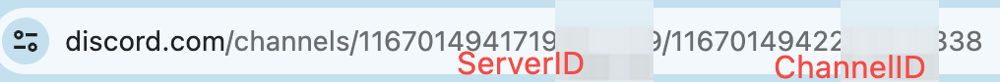

# Gojourney

Gojourney is a package for golang that provides api for midjourney. Using this SDK, you can easily interact with Midjourney.

Support:

- [x] Imagine
- [x] Variation/VaryStrong/VarySubtle
- [x] Upscale/Upscale2x/Upscale4x
- [x] ZoomOut2x/ZoomOut1.5x/CustomZoom
- [x] Ask
- [x] Info
- [x] Reroll
- [x] Show
- [x] GetMessage need yourself bot
- [x] Auto click appeal button
- [x] Get Setting
- [x] Change Speed Mode 


## Getting Started
### Installing
```sh

# Install Gojourney:
go get -u github.com/kiwioneone/gojourney
```

### Usage

Assuming you already have a Midjourney account and have invited the Midjourney bot to your Discord server. If not, please refer to the documentation at [quick start](https://docs.midjourney.com/docs/quick-start) [Image Grid](https://docs.midjourney.com/docs/midjourney-discord).

You need to prepare
1. discord user token [How to Get Discord Token](https://www.geeksforgeeks.org/how-to-get-discord-token/). Please note that the user token may become invalid.
2. ServerID/ChannelID [How To Get Server/Channel ID](https://docs.statbot.net/docs/faq/general/how-find-id/). Alternatively, you can obtain it from the URL of the Discord. 
3. If you want to access detailed message by message id, you need to add your own bot to the server. [Develop Yourself Disord Bot](https://discord.com/developers/applications)


```go
package main

import (
    "fmt"
    "context"
    
    "github.com/kiwioneone/gojourney"  
)

func main() {

	client, err := midjourney.NewClient("your user token",
		"your server id",
		"your channel id",
		midjourney.WithAssistBot("you bot token, not necessary"))
	if err != nil {
		panic(err)
	}

	ctx := context.Background()
	// draw image
	prompt := "a chinese beautiful girl"
	image, err := client.Imagine(ctx, prompt)
	if err != nil {
		fmt.Println("imagine failed")
		return
	}
	fmt.Printf("image url %s\n", image.ImageURL)

	// upscale the 1th image, https://docs.midjourney.com/docs/midjourney-discord
	upscaleImage, err := client.Upscale(ctx, image.MessageID, image.JobID, 1)
	if err != nil {
		fmt.Println("upscale failed")
		return
	}
	fmt.Printf("upscale image url %s\n", upscaleImage.ImageURL)

	return
}
```

It should be noted that there is a call sequence. For example, Upscale can only be called after Imagine.

## Thanks
Our Discord interaction code is based on https://github.com/Goscord/goscord.

## Contributing
Pull requests are welcome. For major changes, please open an issue first to discuss what you would like to change. 

[](https://www.buymeacoffee.com/kiwioneone)